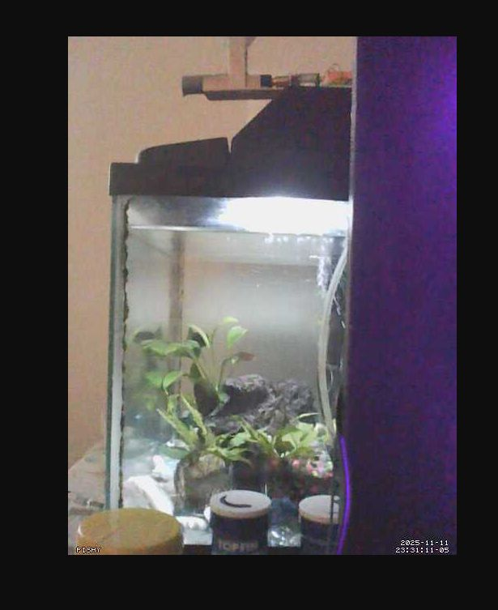

# fishfeeder

This application is designed to control an external daughtercard that consists of a motor and an Archimedes' screw to slowly dispense fish food pellets. Can be run remotely and be paired with a webcam so feeding of fish can be done while you are away.

## Daughtercard schematic
_(todo)_
